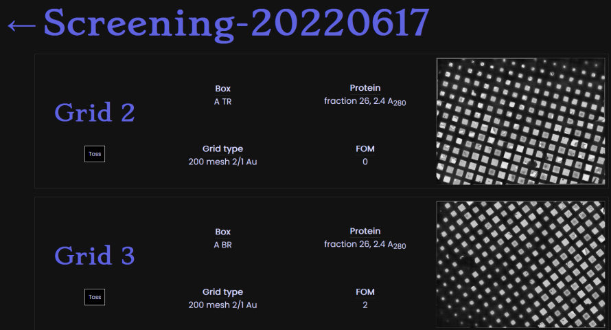
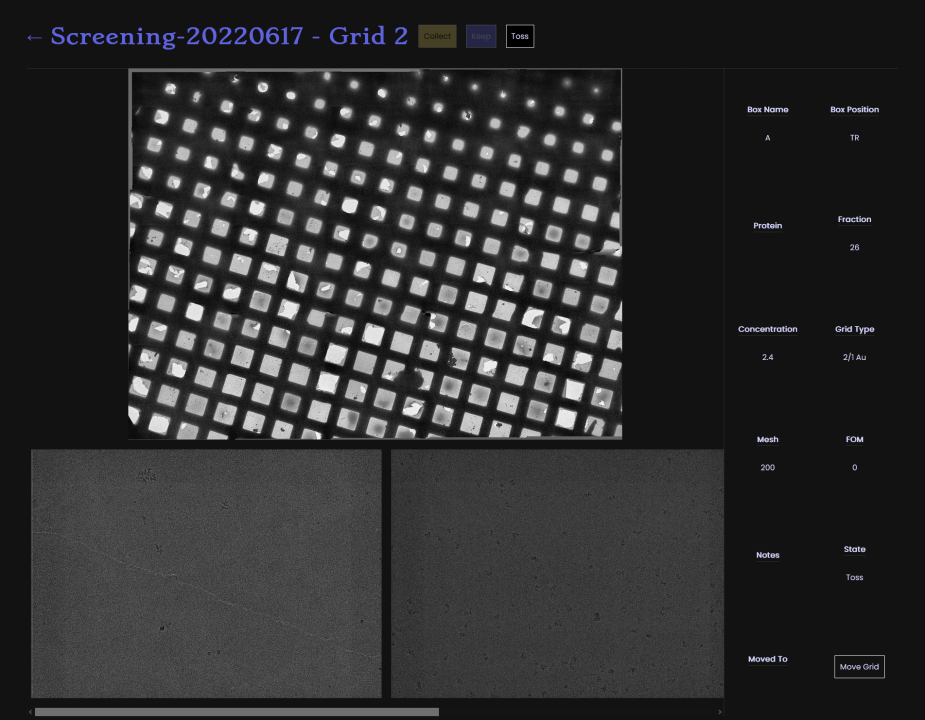

> [!NOTE]  
> This project is no longer maintained. Use something like CryoSPARC Live to monitor your screening solutions.

# Mortimer

Real-time cryoEM screening session monitoring. The goal of this project is to
make sharing results of screening sessions in real time simpler, and to make
accessing that data later easier as well. Moreover, Mortimer aims to keep track
of where promising grids are stored, and what conditions gave rise to them.

It's a bit hacky, but it works™️

## Project setup
You need python (and the requirements in `requirements.txt`), IMOD,
and a couchDB.

Then run:
```
npm install
```

Running
```
npm run dev
```
compiles to development mode, while
```
npm run build
```
compiles and minifies for production.

## What does it do?
Running `mortimer.py process {directory}` will watch the indicated
directory for new grids. In each grid, LMMs are aligned and saved to
a PNG. Movies (must be named `frames_{whatever}.tif`) are roughly aligned
using `alignframes` and converted to a small PNG. Grid information is
input using `grid_info.csv`.

Conventions used to be hard-coded, but can now be modified using various
command-line arguments during processing. Check `mortimer process --help` for details.
Additionally, if you saved aligned movies at the scope instead of raw
frames, that will be automatically detected and handled.

Serving the `app` (with gunicorn or whatever) out of `serve_mortimer.py`
gets you access to the web interface.

Each session gets an object including its path. Clicking on the session
takes you to its overview page, which looks like this:



Each grid displays the information from `grid_info.csv`, as well as
the blended LMM. Clicking on the grid takes you to the Movie Overview
for that grid, which looks like this:



The LMM is reproduced (bigger), and aligned movies (somewhat significantly
binned and contrast-adjusted) are produced below. Grid info is shown to the
right. Above, by the title, there are buttons to indicate whether the user
recommends Collecting on, Keeping, or Tossing the grid. Clicking these buttons
updates their information in the Session Overview automatically. You can also
mark where the grid has been moved to, which is reflected in the Session overview
as well.

## The ugly
Mortimer was slapped together over the course of a day, and I didn't expect
anyone to give a shit about it. As such, there are some hacky things that
you'd need to change if you wanted to use it. I welcome PRs to make this easier.

 1. Image serving relies on a hard-coded path to where I store my screening data
 3. All data are loaded immediately upon page access, meaning anything with more than a couple dozen movies will be very slow (and have huge memory demands)
 4. Screening movies are only roughly aligned and heavily binned.
 5. Users must refresh the page to see new movies/grids
